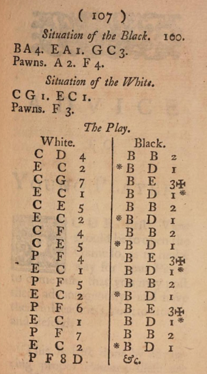

# SRS_wiki

1. Gå in på https://github.com/ChristerNilsson/SRS_wiki
2. Klicka på `Wiki`
3. Klicka på sidan du vill ändra eller `New Page`
4. Klicka på `Edit`
5. Redigera
6. Klicka på `Preview` därefter `Write`.
6. Klicka på `Save` när du är nöjd med sidan.
7. Se resultatet med https://christernilsson.github.io/SRS_wiki/
8. Det kan ta någon minut innan dina ändringar publicerats.

## Lathund för Markdown

För dig som vill skriva enkelt på klubbens wiki

Markdown är ett lätt sätt att skriva text som blir snygg på webben. Man använder några enkla tecken för rubriker, listor, länkar osv.

### Rubriker

```
# Stor rubrik
## Mellanrubrik
### Liten rubrik
```

# Stor rubrik
## Mellanrubrik
### Liten rubrik

### Fet och kursiv stil
```
*kursiv text*  
**fet text**  
***fet och kursiv text***  
```
*kursiv text*  
**fet text**  
***fet och kursiv text***  

### Listor
```
- Första punkten
- Andra punkten
- Tredje punkten
```
- Första punkten
- Andra punkten
- Tredje punkten

### Numrerad lista
```
1. Först
2. Sedan
3. Till sist
```
1. Först
2. Sedan
3. Till sist

### Länkar
```
[Lichess](https://lichess.org)
```
[Lichess](https://lichess.org)

### Bilder
```

```


### Citat
```
> Detta är ett citat.
```
> Detta är ett citat.

### Kod eller schackdrag
```
`e4`
```
`e4`

### Tips

* Använd # rubriker för att strukturera texten.
* Ha tom rad mellan stycken.
* Håll det enkelt – man behöver inte kunna alla finesser.

